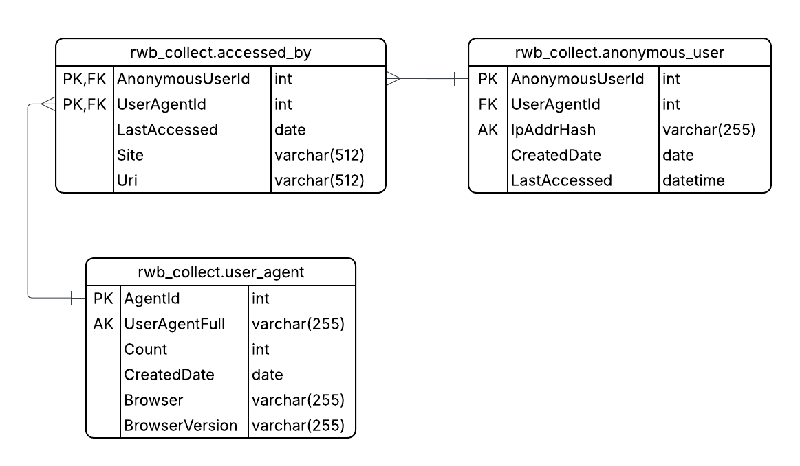

<!--
Copyright (c) 2022-2026 Robert A. Howell
Author: Robert A. Howell
Description: This project was created as a portfolio piece and demonstrates web application development deployed as www.randomwebbits.com.
Created_Date: December 2022
Edited: 2026-07-02
Updated: 2026-05-18
-->

# Random Web Bits  
Author: robhowe-A  
Document date: 12/01/2025  
Technologies: TypeScript, Node.js  
Restrictions: You may not use this code in commercial applications, production environments, or for unauthorized purposes without explicit permission from the author.  

This repository holds source code for the Random Web Bits website. The code here is hosted on the web at [https://randomwebbits.com/](https://randomwebbits.com/). 

**What is it?** A fun project to host short articles about the web and web development.  
**What does it do?** It's a website to showcase modern web development techniques.  

## Frontend  
Built with TypeScript, everything you see on the page(s) is developed using HTML, CSS, and JavaScript (TypeScript) programming languages.  

Because this is a site for fun, much of the code remains client-navigable in the developer's tools. Developers may watch the debug log and look into the component's source code. Fetch calls are directed to the server for security purposes and keeps the data plane sourced to only those originating from controlled domains.  

Fonts and style APIs - those used to change the visual appearance of components - is not data passing from a controlled domain; however, they have been explicitly trusted and are found to be functional and secure when used by chrome, edge, and firefox.  

### Features  

#### Articles  
- Fun bits of knowledge you may/may not know or have seen before.

#### Responsive web design  
- Developed for use on mobile/tablet/desktop devices
- CSS designs fit the wireframe structure and adapt to different viewport sizes

#### JavaScript components  
- A newer web development practice: JavaScript modules represent header, footer, and 'web bits' structures.
- The "home" and "pages" article cards are initialized as a "WebBits" component. They're rendered to the page using vanilla JavaScript, added directly to the DOM as whole fragments.
- PhotoSwipe library is used in showcasing images in multiple locations.

```HTML
...
</head>
<body>
    <main>
    ...
    <acronyms-list></acronyms-list>
    </main>
<body>
</html>
```


<em><u>Release Updates</u></em>

<details open>
<summary>Version 1.0</summary>

1.0.0: Added Favicon to all pages. Edited Header/footer sections  
1.0.4:  
&nbsp;&nbsp;- Image optimizations and attributions.  
&nbsp;&nbsp;- Added footer UL of the requested attributions from FLATICON  
&nbsp;&nbsp;- New WebBits page: ChatGPT  
1.0.6: Script.js changes  
&nbsp;&nbsp;- Added navigation link objects  
&nbsp;&nbsp;- GitHub Desktop - Squash commit history  
1.0.7: New WebBits page: paint3D  
1.0.8: Added dictionary page  
1.0.11:  
&nbsp;&nbsp;- Conformed dictionary.js to module, set to defer on load  
&nbsp;&nbsp;- Added dictionary.js to index.html  
&nbsp;&nbsp;- Changed index page WebBits to show 3 random articles  
1.0.12: New WebBits page: BOINC  
1.0.15:  
&nbsp;&nbsp;- New WebBits page: ipaddress  
&nbsp;&nbsp;- Minor code fixes  
&nbsp;&nbsp;- Web Bits grammar fixes, edits, and corrections  
1.0.16: Minor code fixes  
1.0.19:  
&nbsp;&nbsp;- Dictionary search input validation  
&nbsp;&nbsp;- Added ToDo List page  
&nbsp;&nbsp;- Added ToDo List component on index  
1.0.20:: Refactor code: WebBits.js, script.js  
1.0.22:  
&nbsp;&nbsp;- New WebBits page: markup  
&nbsp;&nbsp;- New WebBits page: searchverticals  
1.0.23: New WebBits page: networkspeed  
1.0.24: Refactor To-Dos List  
1.0.25: New WebBits page: How E-mail Works

</details>

<details open>
<summary>Version 1.1</summary>

1.1.26: Added guides card section  
1.1.28:  
&nbsp;&nbsp;- Lit component: Acronyms List  
&nbsp;&nbsp;- Components update, multiple pages  
1.1.29: New WebBits page: drives

</details>

<details open>
<summary>Version 1.2</summary>

1.2.31:
—
&nbsp;&nbsp;– Module design implementation  
&nbsp;&nbsp;– Component functionality updates  
1.2.32: New WebBits page: virtualtour  
1.2.33: New WebBits guide: applicationtab  
1.2.34: Added PhotoSwipe component to guide: applicationtab  
1.2.35: CSS color revision – dark mode/light mode  
1.2.36: PS updates networkspeed page  
1.2.37: Amend widgets for Firefox functionality  
1.2.38: New WebBits page: dns  
1.2.39: New WebBits page: inspectpages  
1.2.40: Abbr additions, CSS adjustments, and general updates  
1.2.41: New WebBits page: google #1 website

</details>

<details open>
<summary>Version 1.3</summary>

1.3.41: Added TypeScript project compiler  
1.3.43:  
&nbsp;&nbsp;- TypeScript variables changes  
&nbsp;&nbsp;- Header/Footer component addition  
1.3.45: Added DictionaryAPI 404 result  
1.3.46: Dictionary: Local Storage caches  
1.3.47: New WebBits page: DOM  
1.3.48: New WebBits page: webIDE  
1.3.49: New component: GrowingCard  
1.3.50: RWBcards class addition  
1.3.51: New WebBits: SVG  
1.3.52: New Page: flashcards.html  
1.3.53: New WebBits: JavaScript  
1.3.54: New WebBits: PWAIcon  
1.3.55: New WebBits page: LEARN: HTTP  
1.3.56: New WebBits page: CSS  
1.3.57: New WebBits page: GUIDE: Clearing cookies  
1.3.58: New WebBits page: EXPLORE: Webb Space Telescope  
1.3.59: New WebBits page: Latency

</details>

<details open>
<summary>Version 1.4</summary>

1.4.59: Header/Footer refactor  
1.4.60: New WebBits page: HTML-ELEM

</details>

<details open>
<summary>Version 1.5</summary>

1.5.60: Main switch

</details>

<details open>
<summary>Version 1.6</summary>

1.6.60: Widescreens  
1.6.61: PageComponents refactor  
1.6.62: ClassComponents refactor  
1.6.63: Script performance  
1.6.64: New WebBits page: URL  
1.6.65: Heading Title IDs  
1.6.66: Added ColorCode class  
1.6.67: URL, HTML, CSS examples component refactor  
1.6.68: Added mobileMarkup component  
1.6.60: New WebBits page: Data Storage  
1.6.61: Font changes  
1.6.62: Static Object counters  
1.6.63: Domain lookup component  
1.6.63: sliderbar component  
1.6.64: ErrorBus component  
1.6.65: DictionarySearch Log  
1.6.66: ToDos Log  
1.6.67: Widgets Refactor  
1.6.68: Parser component  
1.6.69: Stringify component

</details>

<details open>
<summary>Version 1.7</summary>

1.7.70: Footer addition  
1.7.71: New WebBits page: HSL  
1.7.72: New page: 404.html  
1.7.73: WebBits Slideshow component

</details>

<details open>
<summary>Version 1.8</summary>

1.8.74: Lit Elements: TypeScript //*library removed, 5-18-26*  
1.8.74: PhotoSwipe: TypeScript  
1.8.75: Logo attributions  
1.8.76: Animated Slideshow  
1.8.77: Added project ESLint  
1.8.78: Re-Added todos WebBit  
1.8.78: New WebBits page: ElementInspect  
1.8.79: WebBits Slideshow tabindex  
1.8.80: Header/Footer colors  
1.8.81: Propagation Latency Calculator  
1.8.82: RWB Card CSS  
1.8.83: RWB Card CSS flip direction  
1.8.84: New WebBits page: elementstab  
1.8.85: New WebBits page: consoletab  
1.8.86: New WebBits page: sourcestab  
1.8.87: New WebBits page: networktab  
1.8.88: New WebBits page: performancetab  
1.8.89: New WebBits page: memorytab  
1.8.90: New WebBits page: securitytab  
1.8.91: New WebBits page: lighthousetab  
1.8.92: New WebBits page: cssoverviewtab  
1.8.93: New WebBits page: Hyperlinks  
1.8.94: New WebBits page: Web API  
1.8.95: New WebBits page: Browser Cursors

</details>

## Backend  
Anonymous site usage is collected and stored in the database *[see below picture for reference]*. Collected is the browser's user agent and an anonymized ip address. Tracking with that are the dates and page of the visit.  

This simple model folds together the client's means of rendering the website. Bots and crawlers can be tracked this way and it is used here to find and validate people from malicious intent entities.  

